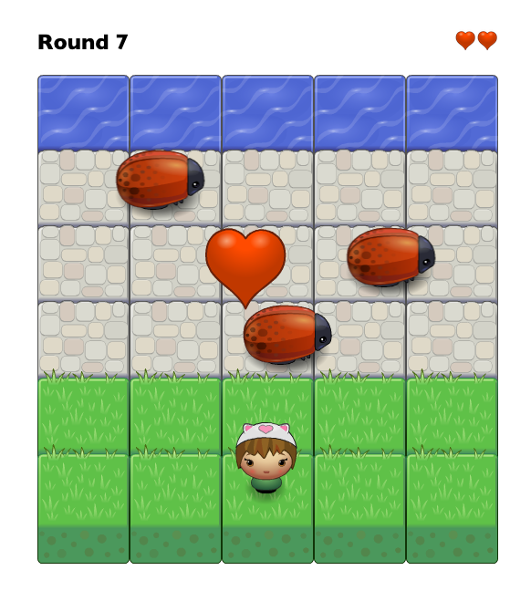

# Frogger
## What it is
This is a Classic Arcade Game Clone and my 3rd project for the Udacity front-end nanodegree. 

## Dependencies
None.

## How to get it started locally
Open the index.html file in your favorite browser and you are ready to go.

## How to play
- use the arrow keys to move the little cat girl around
- the goal is to reach the water on the other side of the road
- do not run into the busy bugs
- collect hearts to gain lifes (up to 5)
- collect gems to slow down the bugs
- collect keys to release some more bugs (or don't)

## How it was build
Engine.js, resources.js and some first lines of code in app.js were provided by Udacity. The rest was carefully crafted by me using only plain JS.

The game counts your rounds (how often you reached the water).

You start with 3 lifes. Every time you hit a bug you lose one life. Every time you collect a heart you gain a life.

There is no end to this game. But a reminder that the real live awaits outside if you play enough rounds.

### have fun
